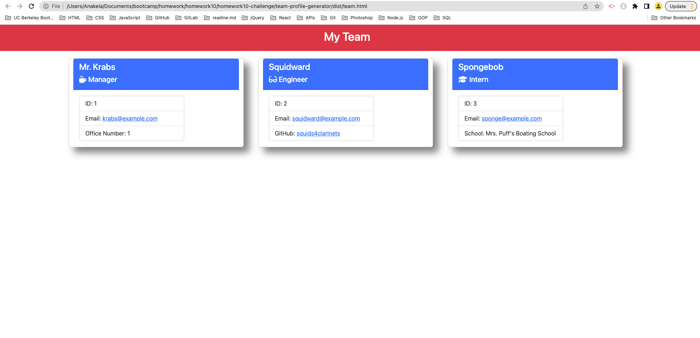

# Challenge 10: Team Profile Generator

## Table of Contents

- [Overview](#overview)
  - [The Challenge](#the-challenge)
  - [User Story](#user-story)
  - [Acceptance Criteria](#acceptance-criteria)
  - [Screenshot](#screenshot)
  - [Links](#links)
- [My Process](#my-process)
  - [Built With](#built-with)
  - [What I Learned](#what-i-learned)
  - [Continued Development](#continued-development)
  - [Useful Resources](#useful-resources)
- [Author](#author)
- [Acknowledgments](#acknowledgments)

## Overview

### The Challenge

Your task is to build a Node.js command-line application that takes in information about employees on a software engineering team, then generates an HTML webpage that displays summaries for each person. Testing is key to making code maintainable, so you’ll also write a unit test for every part of your code and ensure that it passes each test.

Because this application won’t be deployed, you’ll need to provide a link to a walkthrough video that demonstrates its functionality and all of the tests passing. You’ll need to submit a link to the video AND add it to the readme of your project.

> **Note**: There is no starter code for this assignment.

### User Story

```md
AS A manager
I WANT to generate a webpage that displays my team's basic info
SO THAT I have quick access to their emails and GitHub profiles
```

### Acceptance Criteria

```md
GIVEN a command-line application that accepts user input
WHEN I am prompted for my team members and their information
THEN an HTML file is generated that displays a nicely formatted team roster based on user input
WHEN I click on an email address in the HTML
THEN my default email program opens and populates the TO field of the email with the address
WHEN I click on the GitHub username
THEN that GitHub profile opens in a new tab
WHEN I start the application
THEN I am prompted to enter the team manager’s name, employee ID, email address, and office number
WHEN I enter the team manager’s name, employee ID, email address, and office number
THEN I am presented with a menu with the option to add an engineer or an intern or to finish building my team
WHEN I select the engineer option
THEN I am prompted to enter the engineer’s name, ID, email, and GitHub username, and I am taken back to the menu
WHEN I select the intern option
THEN I am prompted to enter the intern’s name, ID, email, and school, and I am taken back to the menu
WHEN I decide to finish building my team
THEN I exit the application, and the HTML is generated
```

### Screenshot



### Links

- Solution URL: [https://github.com/anakela/team-profile-generator](https://github.com/anakela/team-profile-generator)

## My Process

### Built With

- Semantic HTML5 markup
- CSS
- JavaScript
- Node.js

### What I Learned

Use this section to recap over some of your major learnings while working through this project. Writing these out and providing code samples of areas you want to highlight is a great way to reinforce your own knowledge.

To see how you can add code snippets, see below:

```html
<h1>Some HTML code I'm proud of</h1>
```

```css
.proud-of-this-css {
  color: papayawhip;
}
```

If you want more help with writing markdown, check out [The Markdown Guide](https://www.markdownguide.org/) to learn more.

**Note: Delete this note and the content within this section and replace with your own learnings.**

### Continued Development

I would love to use this application in conjunction with a database in the future.  I believe this would allow me to better hone my skills with not only JavaScript and Node.js, but also with SQL and other database technologies.

### Useful Resources

- [Bootstrap](https://getbootstrap.com/)
- [Buddy: Testing with Jest: Start with a basic To­-Do application](https://buddy.works/tutorials/testing-with-jest-basic-to%C2%AD-do-application)
- [Digital Ocean: How To Create Interactive Command-line Prompts with Inquirer.js](https://www.digitalocean.com/community/tutorials/nodejs-interactive-command-line-prompts)
- [Font Awesome](https://fontawesome.com/)
- [Frontend Testing with Jest - Assertions deep dive](https://techblog.topdesk.com/coding/frontend-testing-with-jest-assertions-deep-dive/)
- [Jest: .toEqual(value)](https://jestjs.io/docs/expect#toequalvalue)
- [Jest: Getting Started](https://jestjs.io/docs/getting-started)
- [MDN Web Docs: Classes](https://developer.mozilla.org/en-US/docs/Web/JavaScript/Reference/Classes)
- [MDN Web Docs: drop-shadow()](https://developer.mozilla.org/en-US/docs/Web/CSS/filter-function/drop-shadow)
- [Node.js: File system](https://nodejs.org/api/fs.html)
- [NPM: inquirer](https://www.npmjs.com/package//inquirer)
- [Pakstech: Use Inquirer.js to Create a Conversational CLI User Interface](https://pakstech.com/blog/inquirer-js/)
- [The Pen and Paper Programmer: Repeating questions with 'inquirer.js'](http://www.penandpaperprogrammer.com/blog/2018/12/16/repeating-questions-with-inquirerjs)
- [Valentino G. Blog: Jest Tutorial for Beginners: Getting Started With JavaScript Testing](https://www.valentinog.com/blog/jest/#:~:text=Jest%20is%20a%20JavaScript%20test,default%20choice%20for%20React%20projects.)
- [W3Schools: JavaScript Classes](https://www.w3schools.com/js/js_classes.asp)
- [WikiHow: Create an Email Link in HTML](https://www.wikihow.com/Create-an-Email-Link-in-HTML)

## Author

- GitHub - [https://github.com/anakela](https://github.com/anakela)
- LinkedIn - [https://www.linkedin.com/in/anakela/](https://www.linkedin.com/in/anakela/)

## Acknowledgments

- Fellow Bootcampers:
  - Nolan Spence
  - Ivy Chang
- Bobbi Tarkany (Tutor)
- Matthew Kaus (TA)